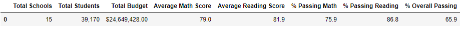
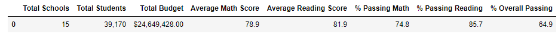

# School_District_Analysis
Analyze, report and present test data for school board

# Overview Of the school district analysis
The purpose of this analysis is to remove the effect of dishonest entries and perform analysis to get the top and bottom 5 schools based on overall passing percentage. Including data frames comparing performance with spending per student, School size & School type.

# Resources
- Software: iPython 7.19.0, anaconda 2020.11 , git version 2.30.1.windows.1
- Data Source: schools_complete.csv, students_complete.csv,PyCitySchools_Challenge.ipynb

# Results
## How is the district summary affected ?

No change was noticed on the Total students, Total Budget, and Average Reading Score Metrics as for the other metrics the changes were slight and as follows.

  - Average Math score from `79.0` to `78.9`.
  - % passing Math from `% 75.9` to `74.8`.
  - % passing Reading from `% 86.8` to `% 85.7`
  - % Overall Passing from `% 65.9` to `% 94.9`
 

  
## How is the school summary affected?

Except for The Thomas High School Data, nothing has changed in the school summary data frame. 

[initial school summary](https://github.com/Donik22/School_District_Analysis/blob/main/Resources/THS%20before%20editing.PNG)
[new district_summary](https://github.com/Donik22/School_District_Analysis/blob/main/Resources/THS%20Updated.PNG)

## How does replace the ninth-grade scores affect the summary?

The only difference in this part of the analysis was on the Thomas High School stats. After modification, We noticed that there was a significant increase across the board Which means that the false data was reflecting negatively on Thomas High School, and upon removing these entries the school was one of the top-performing schools. In the math and reading scores, the values were Identical. In the % passing math and % passing reading Increased from (% 66.91 , % 69.66) to (% 93.19 , % 97.02 ) respectively. lastly, the % overall passing has increased significantly as well going from % 65.08 to % 90.63.

# Summary 

The changes on the school district analysis are summarized by a slight decrease in Average Math score, % passing Math, % passing Reading, % Overall Passing. We get different metrics due to our removal of all Thomas High School 9th graders' data which led to the decrease in the mentioned metrics. due to the huge numbers in our School_complete.csv file, our modification had little effect on the total results.
